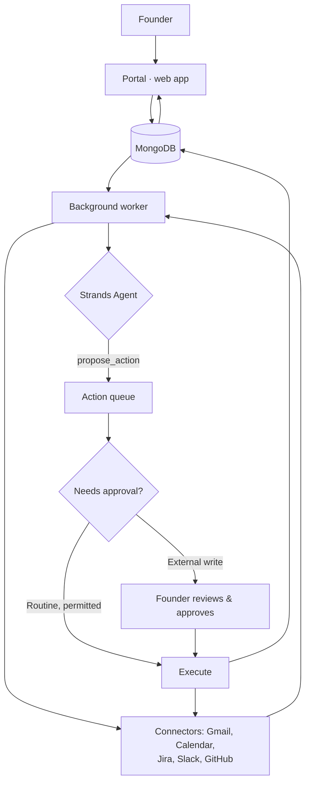

# Architecture

Chief of Staff is a web portal plus a background worker. The portal never
talks to Gmail/Jira/Slack/GitHub directly — every sync and every write
goes through the worker, one job at a time.

## How a briefing works

1. Worker syncs each connected tool into MongoDB (`items` collection).
2. The Strands agent reviews new items for one organization and calls
   `propose_action` for anything worth doing — it never acts directly.
3. Routine actions (e.g. permitted draft replies) queue for execution
   automatically. Anything that sends a message, changes a meeting, or
   writes to Jira/GitHub waits for a human to approve the exact payload.
4. The worker executes approved actions and records the real result —
   `succeeded`, `failed`, or `uncertain` if delivery couldn't be confirmed
   (never silently retried).

## Why it's safe to automate

- **Org-scoped** — every query and every tool call is limited to one
  organization; nothing leaks across tenants.
- **No credentials reach the model** — the agent only ever proposes; a
  fixed set of connector methods does the actual provider call.
- **Approval is real** — the server decides autonomy, not the model.
  External sends and changes always need a recorded human approval.

## AgentCore Runtime (optional)

By default the Strands agent runs in-process in the worker — no AWS setup
needed. Set `AGENTCORE_RUNTIME_ARN` to instead run it on a deployed **Bedrock
AgentCore Runtime**: the worker sends the same context over, and the remote
agent calls back to the portal (`/internal/agentcore/propose`) to actually
queue an action, since it has no direct access to the database. See
`deploy/agentcore_runtime_entrypoint.py` and `deploy/README.md`.
